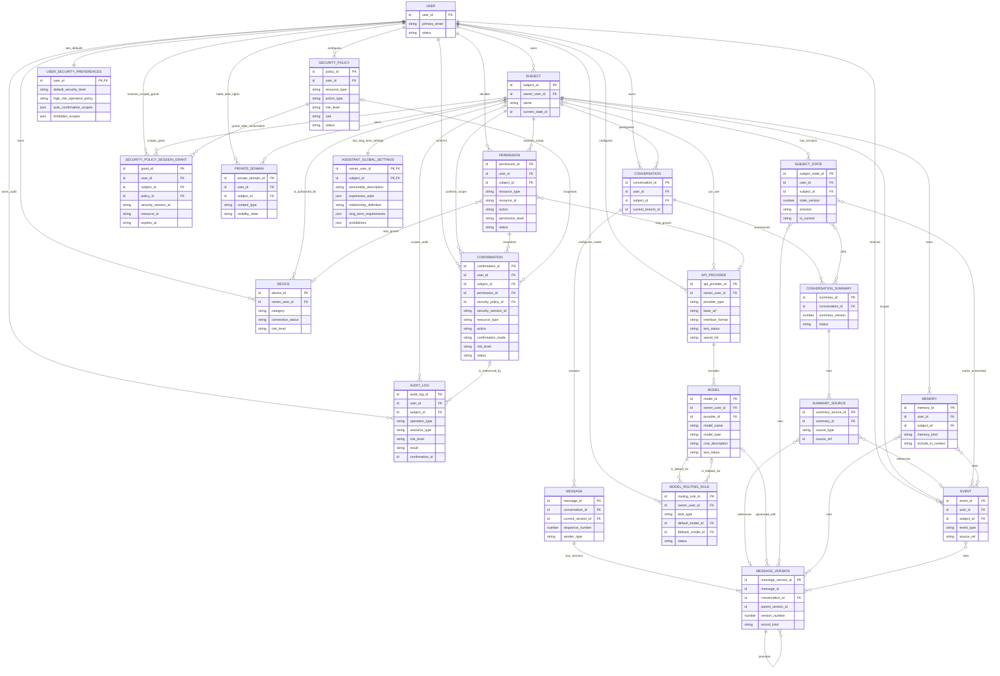
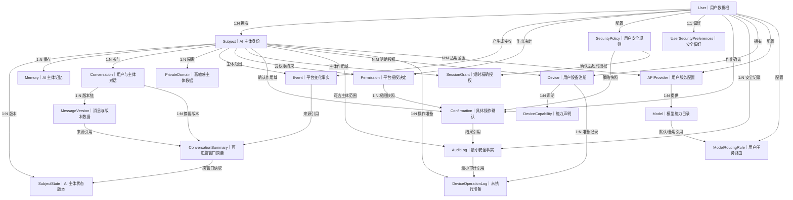
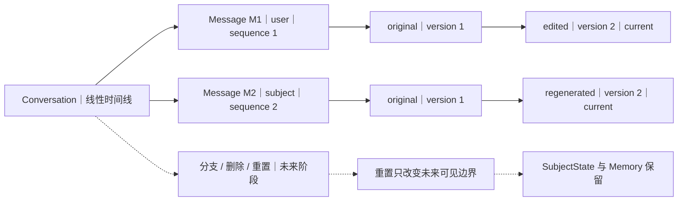
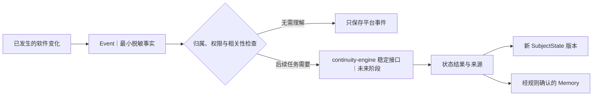
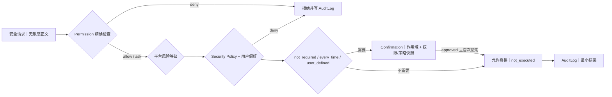

# Vio Live 数据关系图

## 状态与图例

- 当前阶段：逻辑关系基线；User—Subject—AssistantGlobalSettings、Subject—Conversation—Message—MessageVersion—ConversationSummary、SubjectState、User—Subject—Event、User—APIProvider—Model—ModelRoutingRule、User—Device—DeviceCapability、User—Subject—Permission—SecurityPolicy—Confirmation—AuditLog 基础子集已进入开发实现
- 图示层级：概念关系，不代表物理外键、联结表或数据库产品
- `1:N` 表示一对多，`N:M` 表示多对多的逻辑关系
- 用户级对象可以不绑定单一主体；主体级对象必须同时校验 `user_id` 和 `subject_id`

当前开发 SQLite 已实现 `User 1:N Subject`、`Subject 1:1 AssistantGlobalSettings`、`Subject 1:N SubjectState`、`Subject 1:N Conversation`、`Conversation 1:N Message`、`Message 1:N MessageVersion`、`Conversation 1:N ConversationSummary`、摘要到 MessageVersion/Event 的来源引用、`User 1:N Event`、`Subject 1:N Event`、`User 1:N APIProvider`、`APIProvider 1:N Model`、`User 1:N ModelRoutingRule`、`Model 1:N 默认/备用引用`、`User 1:N Device`、`Device 1:N DeviceCapability`、`User/Subject 1:N Permission`、`User 1:N SecurityPolicy`、`User 1:1 UserSecurityPreferences`、精确短时 `SecurityPolicySessionGrant`、`Permission/SecurityPolicy 1:N Confirmation`、`User/Subject/Device 1:N DeviceOperationLog` 以及 `User/Subject 1:N AuditLog`。Context 是读取这些关系形成的临时投影，不是持久实体；Memory 仍未实现。设备主体授权当前通过 `resource_type=device` 的 Permission 表达，Adapter 仅为未配置描述，不代表设备已连接。

数据分类：

- **用户数据**：账号身份、用户输入、用户授权和用户相关内容
- **AI 主体数据**：主体设定、状态、记忆、AI 回复和私域内容
- **平台数据**：事件、权限、版本、连接状态和服务配置

## 核心实体关系图

图中的 `DEVICE`—`SUBJECT`、`API_PROVIDER`—`SUBJECT` 和来源引用关系是逻辑上的多对多关系。当前已实现 APIProvider—Model 目录和用户级 ModelRoutingRule，没有实现 Provider 的主体授权。未来主体适用范围应由明确的授权记录实现，不能把未经校验的任意标识集合直接当作权限依据。

## 数据归属视图

## 关系说明

| 起点 | 终点 | 关系 | 关键约束 |
| --- | --- | --- | --- |
| `User` | `Subject` | 1:N | 每个主体只属于一个用户；主体不能跨用户迁移而不经过受控迁移流程 |
| `Subject` | `AssistantGlobalSettings` | 1:1 | 名称/头像保留在 Subject；扩展设定使用复合归属，更新不能改写 SubjectState |
| `Subject` | `SubjectState` | 1:N | 历史版本保留，同时只有一个当前版本 |
| `Subject` | `Memory` | 1:N | 记忆不能跨主体自动合并；上下文参与由用户控制 |
| `User` / `Subject` | `Event` | 1:N | 用户级事件显式标记用户范围；主体级事件必须带双重归属 |
| `Subject` | `Conversation` | 1:N | 一个对话只绑定一个主体，模型切换不改变关系 |
| `Conversation` | `Message` | 1:N | 当前使用会话内唯一 `sequence_number` 保持线性顺序 |
| `Message` | `MessageVersion` | 1:N | Message 以单一当前指针选择正文，版本不可原地覆盖 |
| `MessageVersion` | `MessageVersion` | 1:N | 当前父关系表示同一消息的编辑或重生成前驱；分支语义尚未实现 |
| `Conversation` | `ConversationSummary` | 1:N | 摘要按会话单调版本、不可变追加；跨窗口只读每个其他会话的最新摘要 |
| `ConversationSummary` | `MessageVersion` / `Event` | N:M 来源 | 每项摘要至少保存一个经用户/主体/会话归属校验的来源 |
| `Subject` | `SubjectState` | 1:N | 状态不可变追加，独立当前指针选择唯一当前版本 |
| `SubjectState` | `MessageVersion` / `Event` / `ConversationSummary` | N:1 来源 | `state_update` 必须有同主体来源，未解决 Event 单独保持有序引用 |
| `User` / `Subject` | `Permission` | 1:N | 读取时同时判断目标、动作、范围、档位和有效期 |
| `User` | `SecurityPolicy` | 1:N | 每个资源类型、动作和风险只有一条活动规则，且只能收紧 Permission |
| `User` | `UserSecurityPreferences` | 1:1 | 保存默认风险、高风险策略、低/中风险自动范围和禁止范围 |
| `SecurityPolicy` / `User` / `Subject` | `SecurityPolicySessionGrant` | 1:N | 确认后生成，绑定策略版本、安全会话、资源、动作和风险，30 分钟失效 |
| `Permission` / `SecurityPolicy` / `User` / `Subject` | `Confirmation` | 1:N | 确认绑定 Permission/Policy 快照与完整作用域，批准后只能消费一次 |
| `User` / `Subject` | `AuditLog` | 1:N | 审计按用户隔离、可选绑定主体，只记录最小安全事实 |
| `Confirmation` | `AuditLog` | 1:N 可选 | 审计可引用确认 ID，但不复制确认之外的敏感正文 |
| `User` | `Device` | 1:N | 当前只保存平台注册元数据；外部设备 ID 与凭据尚无写入结构 |
| `Subject` | `Device` | N:M | 当前通过同用户 `resource_type=device` Permission 表达能力授权，撤销后停止新的操作准备 |
| `Device` | `DeviceCapability` | 1:N | 只声明四类平台能力，不证明设备或 Adapter 实际支持 |
| `User` / `Subject` / `Device` | `DeviceOperationLog` | 1:N | 保存 Permission/Security/Confirmation 准备和事件/审计引用，执行固定为 `not_executed` |
| `Subject` | `PrivateDomain` | 1:N | 正文默认锁定，目录读取不能泄露正文 |
| `User` | `APIProvider` | 1:N | 配置归用户所有，密钥原文不进入业务数据 |
| `User` | `ModelRoutingRule` | 1:N | 每个用户的每类任务只有一条规则，不绑定或改变 Subject |
| `Model` | `ModelRoutingRule` | 1:N 默认/备用引用 | 默认与备用模型必须同用户、支持任务且不能相同 |
| `Subject` | `APIProvider` | N:M | 服务按主体适用范围开放，更换服务不改变主体数据 |
| `APIProvider` | `MessageVersion` | 1:N 可选 | 只记录生成时使用的脱敏配置引用，不复制密钥 |
| `Event` / `MessageVersion` | `Memory` / `SubjectState` | 来源引用 | 形成可追溯关系，不复制不必要的敏感原文 |

## 对话版本关系

- 当前编辑和重生成只追加新 `MessageVersion`，旧版本保持受控历史关系；事件不复制正文。
- 当前只有线性 Message 顺序和同消息版本父链，没有分支、删除或重置实现。
- 未来删除需受保留策略治理；未来分支从明确起点建立，不能复用单一当前指针冒充。
- 未来重置记录属于对话窗口边界，不级联删除主体状态和长期记忆。

## 软件事件与连续性数据流

本图只表达未来数据关系，不代表本阶段已经调用 continuity-engine 或模型。普通页面操作只形成事件，不自动触发模型调用，也不会因为事件存在而获得新权限。

## 权限目标关系

`Permission` 使用 `target_type` + `target_ref` 表达多种受控目标，初始包括：

- 数据类型或模块
- `Device`
- `APIProvider`
- MCP、Skill、插件或 Tool
- 导出、删除或高风险操作

权限记录不替代操作确认。摄像头、门锁、健康、付款、亲密设备和删除账号等高风险动作，即使存在长期允许记录，也需要保存本次操作的具体确认结果。

当前安全关系如下：

Security 预检不会在确认前消费 `allow_once`。只有最终安全检查通过时，命中的 `allow_once` Permission 才转为 `consumed`；只有已批准且在完全相同作用域内被操作准备使用的 Confirmation 才转为 `consumed`。`session_allow` 仅在低/中风险确认消费后建立精确、30 分钟授权；高/极高风险始终逐次确认。每次结果都会记录最小审计。图中没有外部执行节点；设备模块只产生固定 `not_executed` 的准备记录，本阶段不会产生支付、真实设备、MCP、Tool、AI 私域或连续性调用。

## 删除与关系影响

| 删除对象 | 需要处理的关系 | 不应自动删除 |
| --- | --- | --- |
| `User` | 全部主体、对话、权限、设备、服务配置和用户数据进入受控删除流程 | 依法需要暂时保留的最小审计记录 |
| `Subject` | 状态、记忆、会话、私域和主体级权限进入删除流程 | 用户账号、共享设备、共享 API 配置 |
| `Conversation` | 消息版本按用户选择和保留策略处理 | `SubjectState`、独立 `Memory`、独立 `Event` |
| `Memory` | 解除上下文和来源引用，保留必要的删除事件摘要 | 原始对话或事件本身 |
| `Permission` | 规则转为不可用状态；引用旧权限快照的待确认/已批准 Confirmation 不得继续放行 | 已形成且依法保留的最小审计事实 |
| `Confirmation` | 按拒绝、消费、过期或删除策略终止后续使用；不得物理删除来掩盖已经发生的决定 | 已形成且依法保留的最小审计事实 |
| `AuditLog` | 依正式保留、用户权利和法定义务执行受控删除或匿名化 | 不能因删除业务对象而自动级联抹除依法需保留的记录 |
| `Device` | 撤销主体授权、凭据和新调用能力 | 与设备无关的主体和会话数据 |
| `APIProvider` | 密钥引用失效、主体适用关系解除 | 历史消息内容；只保留脱敏服务引用 |
| `PrivateDomain` | 正文、目录、开放状态和访问关系按用户权利处理 | 主体其他状态和记忆，除非用户同时选择删除 |

具体保留期限和物理级联策略等待隐私、数据库与审计 ADR，不能由数据库默认级联行为代替产品规则。

## 必须保持的关系不变量

1. 任一主体级对象的 `user_id` 必须等于该 `Subject.owner_user_id`。
2. 任一 `Conversation`、`MessageVersion`、`SubjectState`、`Memory` 和 `PrivateDomain` 必须属于同一用户和主体组合。
3. `Device` 与 `APIProvider` 的主体作用范围不能跨越其所属用户。
4. 一个主体同时只能有一个当前 `SubjectState`。
5. 同一消息分支上的版本号和当前版本选择必须唯一且可追溯。
6. 权限撤销或到期后，不得产生新的受控调用。
7. 私域正文、设备凭据和 API 密钥不能通过普通关系查询被意外返回。
8. 窗口重置不删除主体状态；模型切换不改变任何数据归属。
9. Confirmation 只能用于相同用户、主体、资源、动作、Permission 快照和策略指纹；过期、拒绝或已消费记录不能再次放行。
10. AuditLog 的可选 `subject_id` 必须属于同一 `user_id`；查询和引用不得跨用户或跨主体泄露。
11. Security Policy 不得将 Permission 拒绝转为允许，且不得跳过 `high` / `critical` 平台逐次确认底线。
12. 短时策略授权必须匹配用户、主体、策略版本、安全会话、资源、动作、风险和有效期。

## 物理实现前仍待决定

- 关系型、文档型或组合存储方案
- 多对多关系和多态来源引用的物理实现
- 当前版本指针与并发写入控制
- 高敏感正文和附件的加密与存储位置
- 删除级联、审计保留和恢复策略
- 索引、分区、容量与清理策略

在这些 ADR 完成前，本图不得直接翻译为生产数据库结构。
