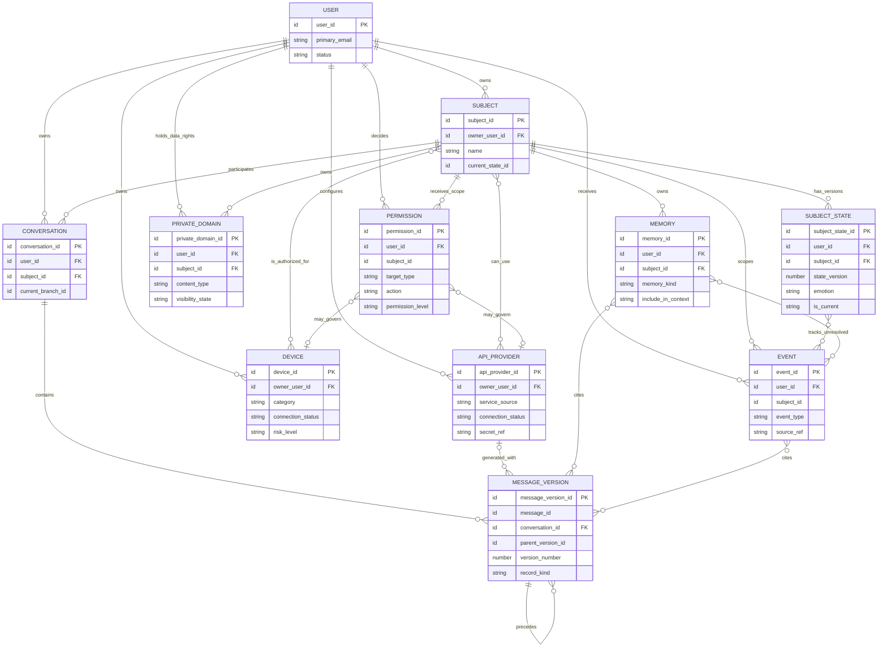
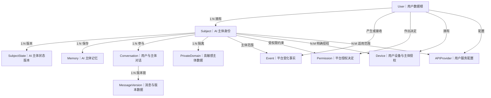
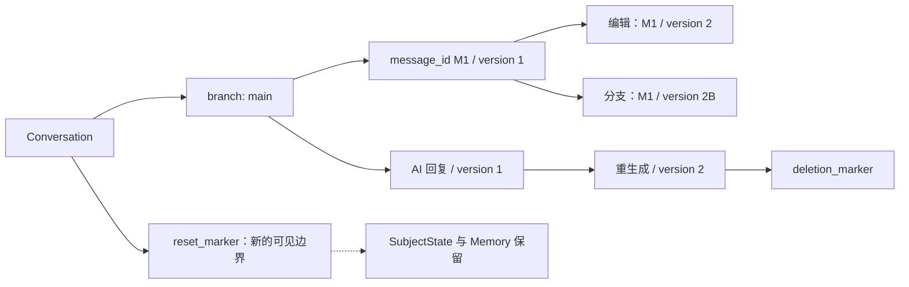
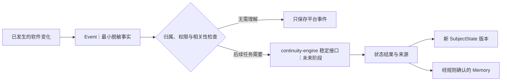

# Vio Live 数据关系图

## 状态与图例

- 当前阶段：逻辑关系基线；User—Subject—Event 基础子集已进入开发实现
- 图示层级：概念关系，不代表物理外键、联结表或数据库产品
- `1:N` 表示一对多，`N:M` 表示多对多的逻辑关系
- 用户级对象可以不绑定单一主体；主体级对象必须同时校验 `user_id` 和 `subject_id`

当前开发 SQLite 已实现 `User 1:N Subject`、`User 1:N Event` 和 `Subject 1:N Event`。Event 的主体关系可为空；存在时由 `(user_id, subject_id)` 复合外键校验归属。图中其他关系仍是后续阶段的概念设计。

数据分类：

- **用户数据**：账号身份、用户输入、用户授权和用户相关内容
- **AI 主体数据**：主体设定、状态、记忆、AI 回复和私域内容
- **平台数据**：事件、权限、版本、连接状态和服务配置

## 核心实体关系图

图中的 `DEVICE`—`SUBJECT`、`API_PROVIDER`—`SUBJECT` 和来源引用关系是逻辑上的多对多关系。未来若选择关系型数据库，应由明确的授权范围或关联记录实现，不能把未经校验的任意标识集合直接当作权限依据。

## 数据归属视图

## 关系说明

| 起点 | 终点 | 关系 | 关键约束 |
| --- | --- | --- | --- |
| `User` | `Subject` | 1:N | 每个主体只属于一个用户；主体不能跨用户迁移而不经过受控迁移流程 |
| `Subject` | `SubjectState` | 1:N | 历史版本保留，同时只有一个当前版本 |
| `Subject` | `Memory` | 1:N | 记忆不能跨主体自动合并；上下文参与由用户控制 |
| `User` / `Subject` | `Event` | 1:N | 用户级事件显式标记用户范围；主体级事件必须带双重归属 |
| `Subject` | `Conversation` | 1:N | 一个对话只绑定一个主体，模型切换不改变关系 |
| `Conversation` | `MessageVersion` | 1:N | 版本通过稳定 `message_id`、父版本和分支标识组成链 |
| `MessageVersion` | `MessageVersion` | 1:N | 一个父版本可产生编辑、重生成或分支版本；版本不可原地覆盖 |
| `User` / `Subject` | `Permission` | 1:N | 读取时同时判断目标、动作、范围、档位和有效期 |
| `User` | `Device` | 1:N | 用户拥有设备；凭据只保存安全引用 |
| `Subject` | `Device` | N:M | 只有同一用户内的主体可被明确授权，撤销后立即停止新调用 |
| `Subject` | `PrivateDomain` | 1:N | 正文默认锁定，目录读取不能泄露正文 |
| `User` | `APIProvider` | 1:N | 配置归用户所有，密钥原文不进入业务数据 |
| `Subject` | `APIProvider` | N:M | 服务按主体适用范围开放，更换服务不改变主体数据 |
| `APIProvider` | `MessageVersion` | 1:N 可选 | 只记录生成时使用的脱敏配置引用，不复制密钥 |
| `Event` / `MessageVersion` | `Memory` / `SubjectState` | 来源引用 | 形成可追溯关系，不复制不必要的敏感原文 |

## 对话版本关系

- 编辑和重生成创建新 `MessageVersion`，旧版本保持受控历史关系。
- 删除标记先使消息在普通聊天流不可见，物理清理由保留策略决定。
- 分支从明确的父版本开始，不复制用户、主体或会话归属。
- 重置记录属于对话窗口边界，不级联删除主体状态和长期记忆。

## 软件事件与连续性数据流

本图只表达未来数据关系，不代表本阶段已经调用 continuity-engine 或模型。普通页面操作只形成事件，不自动触发模型调用，也不会因为事件存在而获得新权限。

## 权限目标关系

`Permission` 使用 `target_type` + `target_ref` 表达多种受控目标，初始包括：

- 数据类型或模块
- `Device`
- `APIProvider`
- MCP、Skill、插件或 Tool
- 导出、删除或高风险操作

权限记录不替代操作确认。摄像头、门锁、健康、付款、亲密设备和删除账号等高风险动作，即使存在长期允许记录，也需要保存本次操作的具体确认结果。

## 删除与关系影响

| 删除对象 | 需要处理的关系 | 不应自动删除 |
| --- | --- | --- |
| `User` | 全部主体、对话、权限、设备、服务配置和用户数据进入受控删除流程 | 依法需要暂时保留的最小审计记录 |
| `Subject` | 状态、记忆、会话、私域和主体级权限进入删除流程 | 用户账号、共享设备、共享 API 配置 |
| `Conversation` | 消息版本按用户选择和保留策略处理 | `SubjectState`、独立 `Memory`、独立 `Event` |
| `Memory` | 解除上下文和来源引用，保留必要的删除事件摘要 | 原始对话或事件本身 |
| `Device` | 撤销主体授权、凭据和新调用能力 | 与设备无关的主体和会话数据 |
| `APIProvider` | 密钥引用失效、主体适用关系解除 | 历史消息内容；只保留脱敏服务引用 |
| `PrivateDomain` | 正文、目录、开放状态和访问关系按用户权利处理 | 主体其他状态和记忆，除非用户同时选择删除 |

具体保留期限和物理级联策略等待隐私、数据库与审计 ADR，不能由数据库默认级联行为代替产品规则。

## 必须保持的关系不变量

1. 任一主体级对象的 `user_id` 必须等于该 `Subject.owner_user_id`。
2. 任一 `Conversation`、`MessageVersion`、`SubjectState`、`Memory` 和 `PrivateDomain` 必须属于同一用户和主体组合。
3. `Device` 与 `APIProvider` 的主体作用范围不能跨越其所属用户。
4. 一个主体同时只能有一个当前 `SubjectState`。
5. 同一消息分支上的版本号和当前版本选择必须唯一且可追溯。
6. 权限撤销或到期后，不得产生新的受控调用。
7. 私域正文、设备凭据和 API 密钥不能通过普通关系查询被意外返回。
8. 窗口重置不删除主体状态；模型切换不改变任何数据归属。

## 物理实现前仍待决定

- 关系型、文档型或组合存储方案
- 多对多关系和多态来源引用的物理实现
- 当前版本指针与并发写入控制
- 高敏感正文和附件的加密与存储位置
- 删除级联、审计保留和恢复策略
- 索引、分区、容量与清理策略

在这些 ADR 完成前，本图不得直接翻译为生产数据库结构。
